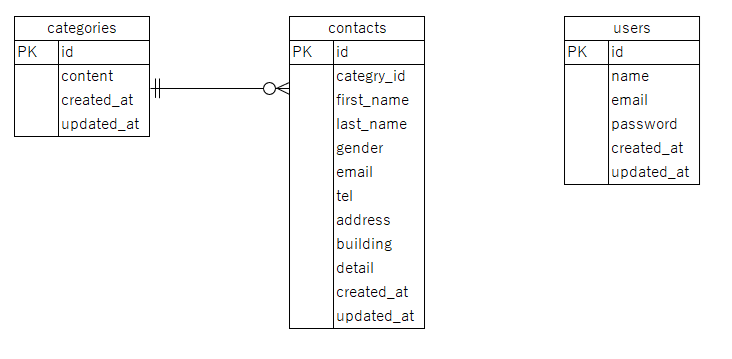

# アプリケーション名
coachtechフリマ

## 概要
ユーザーがアイテムの出品と購入を行えるフリマアプリです。

# 環境構築

## Dockerビルド

### 1. Gitをクローン
```cmd
git clone git@github.com:Yumi-nichika/freemarketApp.git
```

### 2. Dockerを起動
```cmd
docker-compose up -d --build
```

## Laravel環境構築

### 1. PHPコンテナに入る
```cmd
docker-compose exec php bash
```

### 2. コンポーザーをインストール
```cmd
composer install
```

### 3. .envファイルを作成
```cmd
cp .env.example .env
```

### 4. .envファイルを編集
DB接続情報を下記に変更
```env
DB_HOST=mysql
DB_DATABASE=laravel_db
DB_USERNAME=laravel_user
DB_PASSWORD=laravel_pass
```

stripeのAPIキーを追記
```env
# stripe公開可能キー
STRIPE_KEY=your_stripe_key
# stripeシークレットキー
STRIPE_SECRET=your_stripe_secret_key
```

### 5. マイグレーションを実行
```cmd
php artisan migrate
```

### 6. シーダーを実行
```cmd
php artisan db:seed
```

### 7. storageを公開
```cmd
php artisan storage:link
```

### 8. アプリケーションの暗号化キーを生成
```cmd
php artisan key:generate
```

### 9. アクセス
下記「URL」にアクセスし、正常に表示されれば完了です。

# 使用技術（実行環境）
- PHP 8.1.34
- Laravel 8.83.29
- mysql 8.0.26
- nginx 1.21.1

# ER図


# URL
会員登録：http://localhost/register

ログイン：http://localhost/login
```user
テストユーザー①
メールアドレス：tarou@test.com
パスワード：password
```

```user
テストユーザー②
メールアドレス：hanako@test.com
パスワード：password
```

phpMyAdmin:http://localhost:8080

# stripe決済時のテストデータ
カード番号：4242424242424242